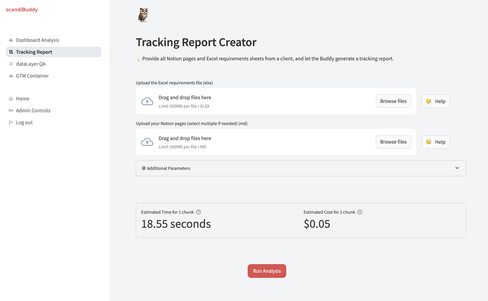

# ScandiBuddy

ScandiBuddy is a web application designed to streamline and enhance the user experience for Scandinavian users, specifically tailored for the Scandiweb growth team. This README provides instructions on setting up, deploying, and running the application.



## Prerequisites

Before you begin, ensure you have met the following requirements:

- Docker installed on your machine
- Google Cloud SDK installed and configured
- Git installed on your machine

## Installation

1. Clone the repository:
    ```sh
    git clone https://github.com/alexkocev/scandi_buddy.git
    cd scandi_buddy
    ```

2. Build the Docker image:
    ```sh
    docker build -t scandi_buddy .
    ```

## Running the Application

1. Run the Docker container locally:
    ```sh
    docker run -p 8080:8080 scandi_buddy
    ```

2. Access the application at `http://localhost:8080`.

## Deploying to Google Cloud Platform

1. Set the default time zone and region:
    ```sh
    gcloud config set run/region europe-west1
    ```

2. Build the container in GCP:
    ```sh
    gcloud builds submit --tag gcr.io/your-project-id/scandi_buddy --no-cache
    ```

3. Deploy the container to GCP:
    ```sh
    gcloud run deploy scandi-buddy --image gcr.io/your-project-id/scandi_buddy --platform managed
    ```

4. Access the deployed application at the URL provided by GCP.

## Environment Variables

Set the necessary environment variables locally:

```sh
echo 'export CLAUDE_KEY_SW="your_real_claude_key"' >> ~/.bashrc
echo 'export GOOGLE_CLIENT_SECRET_SCANDIBUDDY="your_google_client_secret"' >> ~/.bashrc
source ~/.bashrc
```

Alternatively, you can edit the `~/.bashrc` file directly and then source it:
```sh
nano ~/.bashrc
source ~/.bashrc
```

## Features

ScandiBuddy offers the following features for the Scandiweb growth team:

- **Streamlit Integration**: The application uses Streamlit to create interactive and user-friendly web interfaces for data visualization and analysis.
- **Claude AI API**: Integration with Claude AI API to provide advanced AI capabilities, including natural language processing and data insights.
- **Google Authentication**: Secure user authentication using Google OAuth, ensuring that only authorized users can access the application.
- **Real-time Data Analysis**: Tools and dashboards for real-time data analysis to support the growth team's decision-making processes.
- **Customizable Reports**: Generate and export customizable reports based on user-defined parameters and filters.


This project is made by Alexandre Kocev for Scandiweb.

